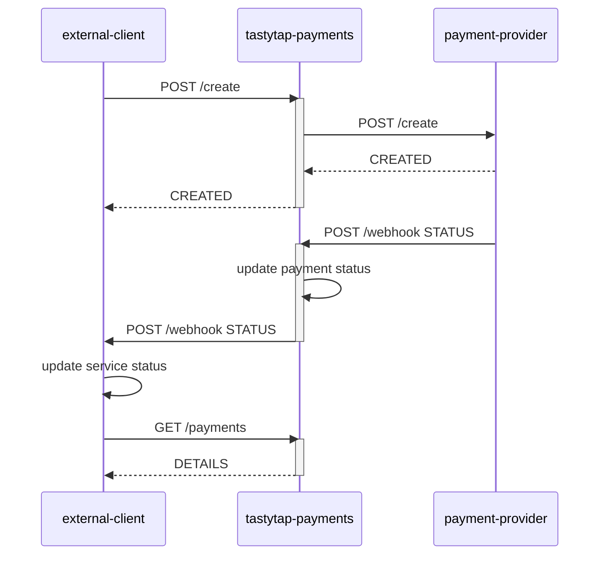

# tastytap-payment
Repositório da aplicação de pagamentos - Software Architecture da FIAP.

## fluxo:

----
### grupo:
- [Gabriel Ronei de Oliveira Paulo](https://github.com/gabrielronei) - RM355521
- [Thais Thomazini André](https://github.com/thaisandre) - RM355319